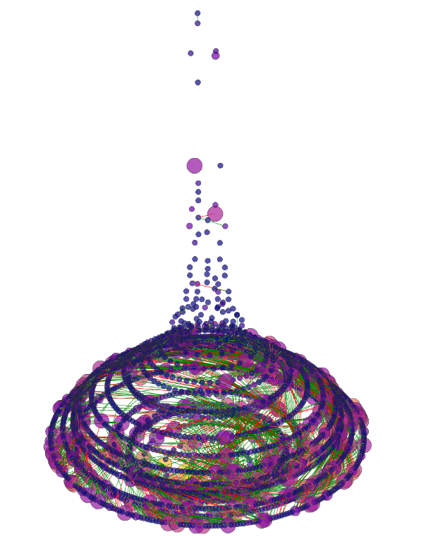

# Documentation for how to customize Python/Plotly Dowker Visualization Script

Dowker graph generation with plotly takes an error matrix and creates a 3D plotly graph in html. The dowker shows the topological structure of a set of data. We provide multiple visualization options. Generation occurs in 2 steps:
- Processing the error matrix into dictionaries, with mappings like node:display value, node:position, node:count, etc.
- Fitting the dictionary values into Plotly's format to display and save a HTML file with the 3D dowker

## Provided Artifacts

We provide some sample npz error matrices from DARPA SafeDocs:
- Eval Three PDF files
- Good Universe A PDF files
- NITF files


## Required Inputs
- Binary Error Matrix saved as dense npz file
- Name of dowker to be displayed
- Output directory to save the output dowker html (-o)
Optional
- '-swap': to flip around any feature that occurs in more than 50% of samples to be 'feature does not exist)
- '-default': Use default visualization options instead of being asked for prompted display options (circular layout, color and size by weight, inconsistent edge coloring, etc)

## Example usage

To generate a default dowker for the NITF files, run:
```
python errorMatrixToDowker_v1.py artifacts/nitf_error_matrix.npz nitf -o <output directoyr> -swap -default 
```
If you want to choose your own customizations, skip the '-default' flag:
```
python errorMatrixToDowker_v1.py artifacts/nitf_error_matrix.npz nitf -o <output directoyr> -swap 
```

To generate a larger dowker (this will take a few minutes), use the goodA error matrix:
```
python errorMatrixToDowker_v1.py artifacts/goodA_error_matrix.npz nitf -o <output directoyr> -swap -default 
```
You should get the figure below:




## Processing the error matrix

To generate the dowker, we need a list of node positions, edge positions, and optionally other display properties such as color, hovertext, etc. Most importantly, we need to find the unique set of nodes, and which nodes are connected to each other.

The error matrix is converted into a sparse format, with features as columns, and files as rows. If file n exhibits feature m, then entry [n, m] in the matrix is a 1, 0 otherwise. 

Each unique row forms a single node in the dowker graph, so we collect all information about that node: count, display name, connected nodes, etc.

For example, let us assume we have a row [0, 1, 0, 0, 1], or this file exhibits features 1 and 4. The display name is 1,4. The connected nodes in the nodes with one less feature, or nodes 1 and 4. 

### String positioning

There are multiple possible ways to arrange the nodes, with force-directed, circular layout, etc implemented. The user then selects which layout to use in createStringPosMap. 

### Edge determination

Inconsistent edges mean that the node with more features has heigher weight. Currently, we color edges red if inconsistent, green otherwise. Additional edge colorings can be implemented.

### Dialect assignment

[Dialect detection](https://arxiv.org/pdf/2201.08267.pdf) divides nodes into ‘dialects’, where each dialect is intended to contain similar files. A single node can be in multiple dialects, with the new dialect usually forming at ‘inconsistent edges’. 

The dialect algorithm walks the dowker complex from the lowest level node (fewest features) to connected nodes (all higher-level nodes whose node), and assigns a number of files in the dialect, where the number of files assigned to a dialect going up the tree never increases.

Nodes grouped together in a dialect must have a single ‘root’, where the root consists of feature(s) all the nodes in the dialect contain. For example, dialect 0 can consist of the root ‘’ node with no errors, and all nodes can be part of that dialect. On the other hand, another dialect with root ‘10’ can contain nodes ‘1,10’, ’10,20’, ‘1,10,100, 120…’, etc, but not node ‘1’ or ‘1,20,100’. 

The dialect assignment algorithm iterates through from the bottom of the dowker graph, at the node(s) with fewest features, starting from the highest weight node if there are multiple. Starting from the current root, a new dialect is assigned to that root, and all nodes with weight left which are connected to it, using a breadth-first search. At each step, if there are multiple nodes which we can explore, we start with the node with highest weight. The pseudocode is below:

#### Dialect assignment algorithm
```
Create dictionary of dialect: nodes in dialect
Initialize current dialect to “dialect_0” (this can be changed)
Initialize node_weight_left map with weight_left as node_weight
For length =0; length<max feature length in dowker, length=length+1:
   Sort all nodes at length==feature_length
    For node in nodes with feature length == length:
       Current dialect = Increment current dialect (dialect_0 -> dialect 1, etc)
        If node_weight_left > 0 and node not already in node_dialect_dictionary[node]:
	Dialect weight (for this node and all subsequent nodes) = node_weight_left
	Add node to dialect_nodes_map[current_dialect]
              Iterate through all reachable nodes 
```

### Artifacts

Intermediate files created:
- HashedRow to Count Map
- HashedRow to Node (display) name

### Options 

Customizable Attributes
- Layout/Positioning
    - Circular layout
    - Grouping by connected nodes across layers layout
    - 2D spring layout
    - Force-directed 
    - Force-directed by layers
- Node Color
    - Color by weight
    - Color by max dialect number
    - Color by number of dialects in node
    - Color by dialect gradient (works best with only 3 gradients, with each gradient contributing to r, g, or b)
    - Color by dialect gradient hex values (works best with 6 or fewer gradients, each gradient contributing to a digit of the hex value)
- Node Size
    - Default all same size
    - Weight 
- Edge Color
    - Default all black 
    - Consistent (green) vs Inconsistent (red)
- Annotation
    - Node name
    - Node Feature Length (Number of 1s in row of matrix)
    - Node weight (int)
    - Files at this node
- Node filter
    - Max feature length


 

